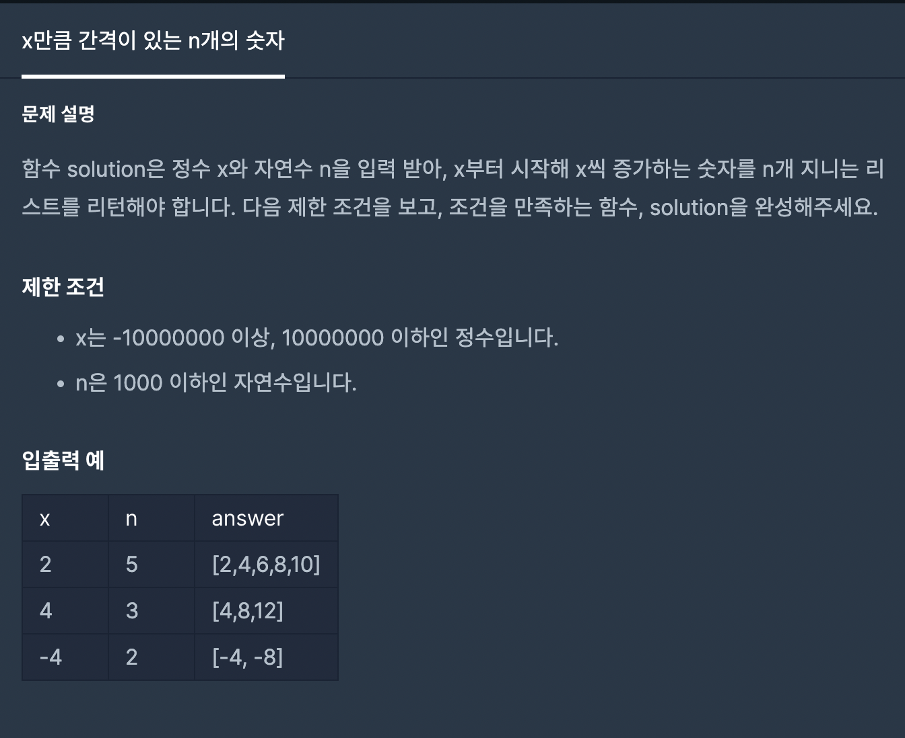
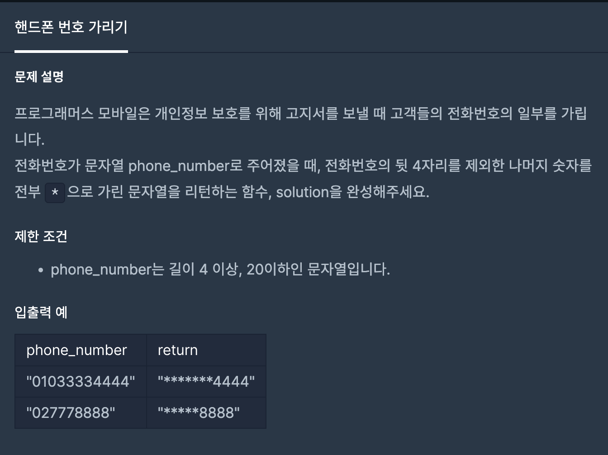
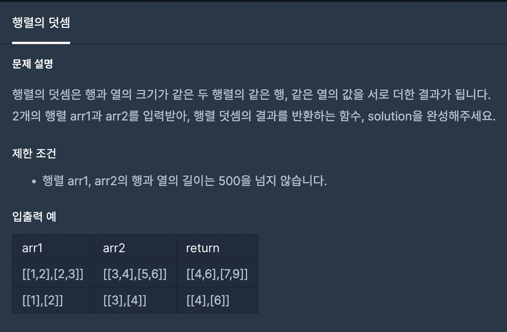
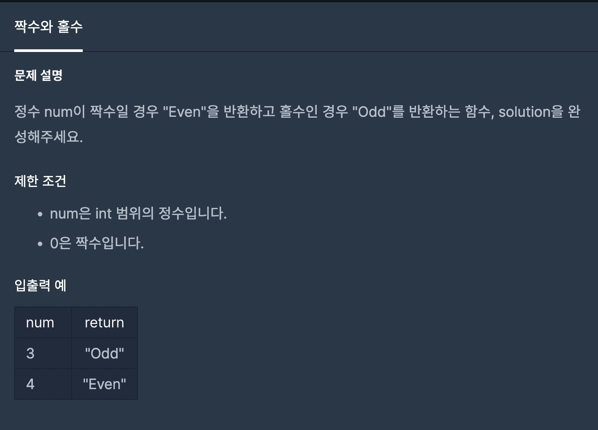
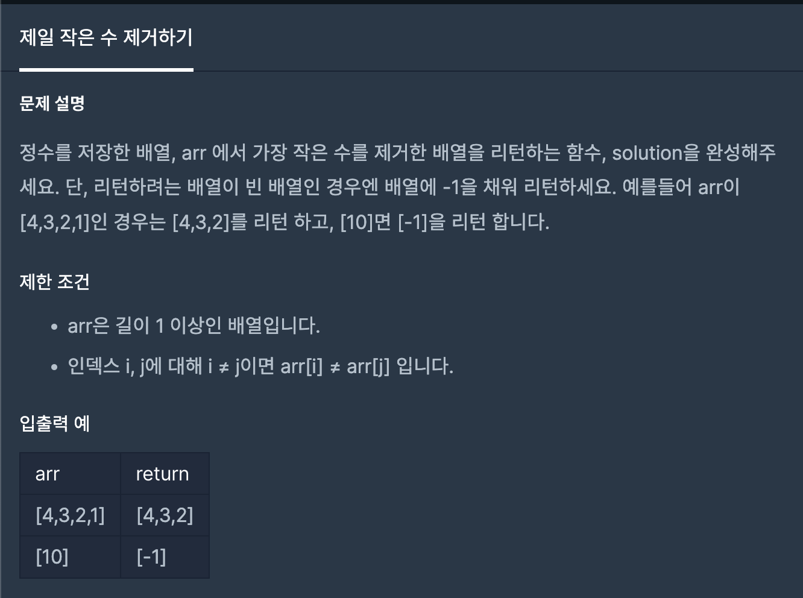
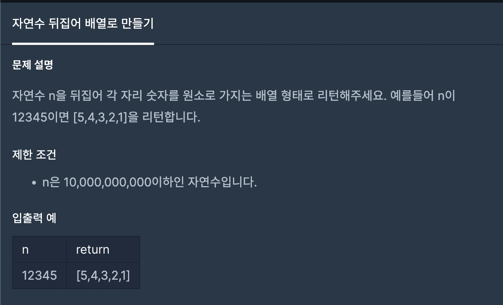

## 자바스크립트 알고리즘(feat. 프로그래머스)

<br>

## GOAL 🙋🏻‍♀️

- README.md 파일에 사진과 코드를 기록으로 남기고, 다른 사람들의 코드도 분석하며, 알고리즘 실력을 향상시킨다.
- 클린 코딩을 생활화하고, 깊이있는 학습을 목표로 한다.

<br>

## WARNING ❗️

- 배열의 고차함수를 적극적으로 사용하며, 메모리의 사용을 최소화한다.
- 문제 설명과 제한 조건이 기록된 이미지 파일을 같이 첨부하고, 코드 또한 README.md 파일에 기록한다.

<br>
<br>

## 1. 1단계 문제

### 1-1. x만큼 간격이 있는 n개의 숫자

<br>



```javascript
function solution(x, n) {
	return new Array(n).fill(x).map((value, index) => value * (index + 1));
}

function solution(x, n) {
	const result = [];
	let i = 1;
	while (i <= n) {
		result.push(x * (i));
		i++;
	}
  return result;
}
```
### 1-2. 핸드폰 번호 가리기

<br>



```javascript
const solution = (phoneNumber) => {
  const arr = phoneNumber.split('');
  let i = 0;
  while (i < arr.length) {
    arr[i] = arr.length > 4 ? '*' : arr[i];
    i++;
  }
  return arr.join('');
}

const solution = (phonNumber) => {
  return phonNumber.split('').map((str, index) => (phoneNUmber.length - index) > 4 ? '*' : str);
}

const solution = (phoneNumber) => {
  return '*'.repeat(phoneNumber.length - 4) + phoneNumber.slice(phoneNumber.length - 4, phoneNumber.length);
}
```

### 1-3. 행렬의 덧셈

<br>



```javascript
const funcSolution = (arrArg01, arrArg02) => {
	let arrResult = new Array(arrArg01.length).fill(0).map(()=> new Array(arrArg01[0].length).fill(0));
	let i = 0;
	let j = 0;
	while (i < arrArg01.length) {
		while (j < arrArg01[i].length) {
			arrResult[i][j] = arrArg01[i][j] + arrArg02[i][j]
			j++;
		}
		j = 0;
		i++;
	}
	return arrResult;
};

const funcSolution = (arrArg01, arrArg02) => {
  return arrArg01.map((value01, index01) => value01.map((value02, index02) => value02 + arrArg02[index01][index02])) 
}
```

### 1-4. 짝수와 홀수

<br>



```javascript
const funcSolution = (numArg) => {
  return ( numArg % 2 ) ? "Odd" : "Even";
}
```

### 1-5. 제일 작은 수 제거하기

<br>



```javascript
function solution(arrArg) {
	return arrArg.length > 1 ? arrArg.filter((num) => num !== Math.min(...arrArg)) : [-1];
};
```

### 1-6. 자연수 뒤집어 배열로 만들기

<br>



```javascript
function solution(n) {
	return n.toString().split('').reverse().map((num) => parseInt(num));
}
```