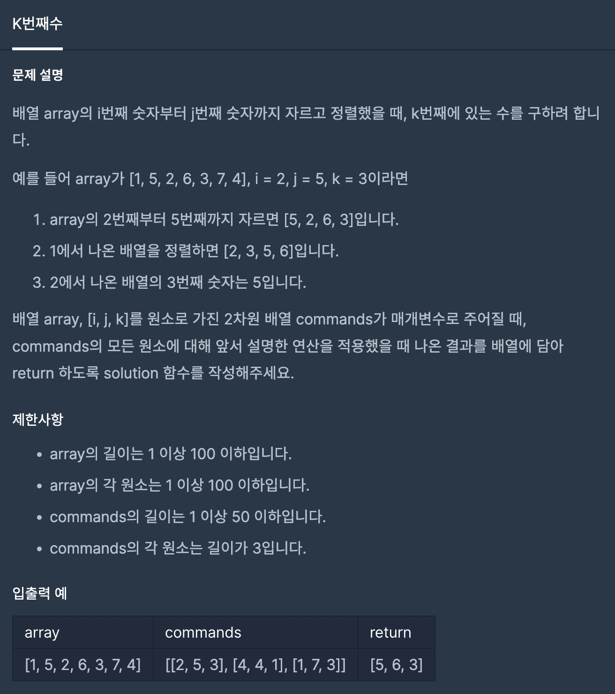

## 자바스크립트 알고리즘(feat. 프로그래머스)

<br>

## GOAL 🙋🏻‍♀️

- README.md 파일에 사진과 코드를 기록으로 남기고, 다른 사람들의 코드도 분석하며, 알고리즘 실력을 향상시킨다.
- 클린 코딩을 생활화하고, 깊이있는 학습을 목표로 한다.

<br>

## WARNING ❗️

- 배열의 고차함수를 적극적으로 사용하며, 메모리의 사용을 최소화한다.
- 문제 설명과 제한 조건이 기록된 이미지 파일을 같이 첨부하고, 코드 또한 README.md 파일에 기록한다.

<br>
<br>

## 1. 1단계 문제

### 1-1. x만큼 간격이 있는 n개의 숫자

<br>


```javascript
function solution(x, n) {
	return new Array(n).fill(x).map((value, index) => value * (index + 1));
}
```
```javascript
function solution(x, n) {
	const result = [];
	let i = 1;
	while (i <= n) {
		result.push(x * (i));
		i++;
	}
  return result;
}
```

### 1-2. 핸드폰 번호 가리기

<br>


```javascript
const solution = (phoneNumber) => {
  const arr = phoneNumber.split('');
  let i = 0;
  while (i < arr.length) {
    arr[i] = arr.length > 4 ? '*' : arr[i];
    i++;
  }
  return arr.join('');
}
```
```javascript
const solution = (phonNumber) => {
  return phonNumber.split('').map((str, index) => (phoneNUmber.length - index) > 4 ? '*' : str);
}
```
```javascript
const solution = (phoneNumber) => {
  return '*'.repeat(phoneNumber.length - 4) + phoneNumber.slice(phoneNumber.length - 4, phoneNumber.length);
}
```

### 1-3. 행렬의 덧셈

<br>


```javascript
const funcSolution = (arrArg01, arrArg02) => {
	let arrResult = new Array(arrArg01.length).fill(0).map(()=> new Array(arrArg01[0].length).fill(0));
	let i = 0;
	let j = 0;
	while (i < arrArg01.length) {
		while (j < arrArg01[i].length) {
			arrResult[i][j] = arrArg01[i][j] + arrArg02[i][j]
			j++;
		}
		j = 0;
		i++;
	}
	return arrResult;
};
```
```javascript
const funcSolution = (arrArg01, arrArg02) => {
  return arrArg01.map((value01, index01) => value01.map((value02, index02) => value02 + arrArg02[index01][index02])) 
}
```

### 1-4. 짝수와 홀수

<br>


```javascript
const funcSolution = (numArg) => {
  return ( numArg % 2 ) ? "Odd" : "Even";
}
```

### 1-5. 제일 작은 수 제거하기

<br>


```javascript
function solution(arrArg) {
	return arrArg.length > 1 ? arrArg.filter((num) => num !== Math.min(...arrArg)) : [-1];
};
```

### 1-6. 자연수 뒤집어 배열로 만들기

<br>


```javascript
function solution(n) {
	return n.toString().split('').reverse().map((num) => parseInt(num));
}
```

### 1-7. 약수의 합

<br>


```javascript
function solution(num) {
	let result = 0;
	let i=0;
	let j=0;
	while(i <= num) {
		while(j >= 1) {
			i * j === num && (result += i)
			j++;
		}
		j =num;
		i++;
	}
	return result;
}
```
```javascript
function solution(num) {
	let result = 0;
	for(let i=0; i<num; i++) {
		num % i === 0 && (result += i)
	}
	return result;
}
```
```javascript
function sumDivisor(num) {
	var d1 = [];
	var sqrt = Math.sqrt(num);
	for (var i = 1; i < sqrt; i++) {
		if (num % i == 0) d1.push(i);
	}
	var d2 = d1.map((v) => num / v);
	return d1.reduce((a, b) => a + b) + d2.reduce((a, b) => a + b);
}
```

### 1-8. 문자열을 정수로 바꾸기

<br>


```javascript
function solution(s) {
	return +s;
}
```

### 1-9 문자열 다루기 기본

<br>


```javascript
function solution(str) {
	return (str.length == 4 || solution.length == 6) && str.split('').every((value) => !isNaN(value));
}
```
```javascript
function solution(s) {
	return /^\d{4}$|^\d{6}$/.test(s)
}
```

### 1-10 서울에서 김서방 찾기

<br>


```javascript
function solution(seoul) {
	return `김서방은 ${seoul.findIndex((name) => name == 'Kim')}에 있다`;
}
```

```javascript
function solution(seoul) {
	return `김서방은 ${seoul.map((name,index) => name == 'Kim' ? index : name ).filter((value) => value == +value).join('')}에 있다`
}
```
```javascript
function solution(seoul) {
	for (let i = 0; i < seoul.length; i++) {
		if (seoul[i] == 'Kim') {
			return `김서방은 ${i}에 있다`;
		}
	}
}
```

### 1-11 두 개 뽑아서 더하기

<br>


```javascript
function solution(numbers) {
	const result = [];

	for (let i = 0; i < numbers.length - 1; i++) {
		for (let j = i + 1; j < numbers.length; j++) {
			result.push(numbers[i] + numbers[j]);
		}
	}

	result.sort((a, b) => a - b);

	let i = 0;
	let j = 1;
	while (i < result.length - 1) {
		while (j < result.length) {
			if (result[i] == result[j]) {
				result.splice(j, 1);
				continue;
			}
			j++;
		}
		i++;
		j = i + 1
	}

	return result;
}
```
```javascript
function solution(arrArg) {
	const answer = new Set();
	for(let i=0; i<arrArg.length-1; i++) {
		for(let j=i+1; j<arrArg.length; j++) {
			answer.add(arrArg[i]+arrArg[j])
		}
	}
	return [...answer].sort((a,b) => a - b);
}
```

### 1-12 두 정수 사이의 합

<br>


```javascript
function solution(num01,num02) {
	let numAnswer = 0;
	if(num01 < num02) {
		for(let i=num01; i<=num02; i++ ) {
		numAnswer += i;
		}
	} else {
		for(let i=num02; i<=num01; i++){
			numAnswer +=i;
		}
	}
	return numAnswer;
}
```
```javascript
function solution(num01, num02) {
	let numAnswer = 0;
	for (let i = Math.min(num01, num02); i <= Math.max(num01, num02); i++) {
		numAnswer += i;
	}
	return numAnswer;
}
```

### 1-13 내적

<br>


```javascript
function solution(arrArg01,arrArg02) {
	return arrArg01.map((value01,index)=> value01 * arrArg02[index]).reduce((pre,cur)=>(pre+=cur))
}
```

### 1-14 K번째수

<br>



```javascript
function solution(array, commands) {
	const result = [];
	let i = 0;
	while (i < commands.length) {
		const arr = array.slice(commands[i][0] - 1, commands[1]).sort((a, b) => a - b);
		result.push(arr[commands[i][2] - 1]);
		i++;
	}
	return result;
}
```
```javascript
function solution(arrArg, commands) {
	return commands.map((value) => arrArg.slice(value[0] - 1, value[1]).sort((a, b) => a - b)[value[2] - 1]);
}
```

### 1-15 수박수박수박수박수박수?

<br>


```javascript
function solution(n) {
    let result = '';
    for(let i=0; i<n; i++) {
        result += i % 2 ? '박' : '수';
    }
    return result;
}
```
```javascript
function solution(n) {
    let i =0;
    let result ='';
    while(i < n) {
        result += i % 2 ? '박' : '수';
        i++;
    }
    return result;
}
```

### 1-16 자릿수 더하기

<br>


```javascript
function solution(N) {
    return N.toString().split('').reduce((pre, cur) => pre + +cur, 0);
}
```

### 1-17 문자열 내 p와 y의 개수

<br>


```javascript
function solution(s) {
	if(/p|y/gi.test(s)) {
		if(s.toUpperCase().split('P').length === s.toUpperCase().split('Y').length) {
			return true;
		} else {
			false;
		}
	}else {
		return true;
	}
}
```
```javascript
function solution(s) {
	return !/p|y/gi.test(s) ? true : (s.toUpperCase().split('P').length === s.toUpperCase().split('Y').length ? true : false); 
}
```

### 1-18 나누어 떨어지는 숫자 배열

<br>


```javascript
function solution(arr, divisor) {
	return arr.filter((value)=> value % divisor == 0).length == 0 ? [-1] : arr.filter((value)=> value % divisor == 0).sort((a,b)=>(a-b))
}
```

### 1-19 같은 숫자는 싫어

<br>


```javascript
function solution(arr) {
    var answer = [];
    answer.push(arr[0])
   for(let i=1; i < arr.length; i++ ){
       if(arr[i] !== arr[i-1]) {
           answer.push(arr[i])
       }
   }
    return answer;
}
```
### 1-20 가운데 글자 가져오기

<br>


```javascript
function solution(s) {
   return s.length % 2 ? s[Math.floor(s.length / 2)] :  s[s.length / 2 - 1]+ s[s.length / 2]
}
```

### 1-21 나머지가 1이 되는 수 찾기

<br>


```javascript
function solution(n) {
    let x = 2;
    while(true) {
        if( n % x == 1) return x;
            x++;
    }
}
```

### 1-22 2016년

<br>


```javascript
function solution(a, b) {
    const days= ['SUN','MON','TUE','WED','THU','FRI','SAT'];
    let date = new Date(`2016/${a}/${b}`);
    let answerDate = days[date.getDay()]
   
    return answerDate;
}
```

### 1-23 예산

<br>


```javascript
function solution(d, budget) {
    return d.sort((a,b) => a-b).filter(num => { 
        budget = budget - num; 
        return budget >= 0;
    }).length;
}
```

```javascript
function solution(d, budget) {
    const arr = d.sort((a, b) => a - b);
    let result = 0;
    let i = 0;
    
    while (i < arr.length) {
        budget = budget - arr[i];
        if (budget >= 0) {
            result++;
        } else {
            return result;
        }
        i++;
    }
    return result;
}
```

### 1-24 음양 더하기

<br>


```javascript
function solution(absolutes, signs) {
    return absolutes.map((num, index) => signs[index] ? num : -num).reduce((pre, cur) => pre += cur, 0);
}
```

### 1-25 부족한 금액 계산하기

<br>


```javascript
function solution(price, money, count) {
	let i = 1;
  let num =0;
  while( i <= count) {
    num += price * i;
    i++;
  }
  return money - num > 0 ? 0 : -1 * (money-num)
}
```

### 1-26 이상한 문자 만들기

<br>


```javascript
function solution(s) {
  return s.split(' ').map((value) => value.split('').map((spell,index)=> index % 2 ? spell.toLowerCase() : spell.toUpperCase()).join('')).join(' ');
}
```